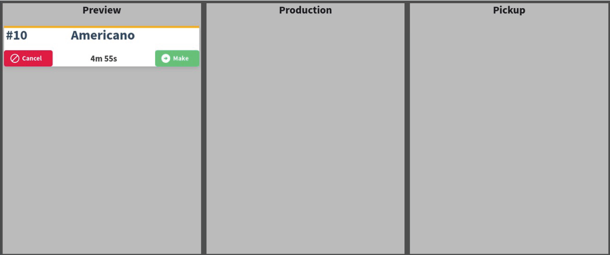
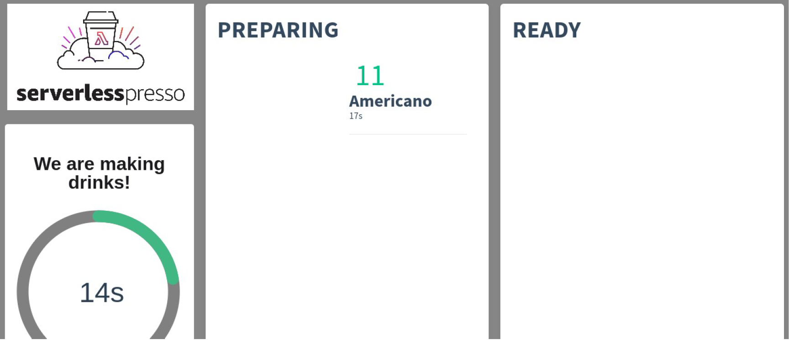
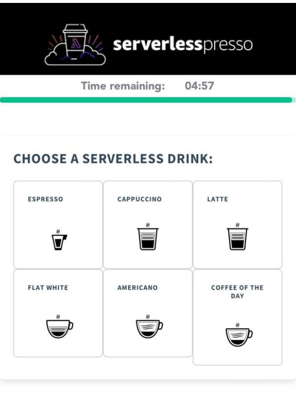

# ☕ Serverlesspresso - Backend Serverless sur AWS

## 📖 Description courte

Ce projet consiste à développer un backend **serverless** pour une application de gestion de commandes de café, destinée à un événement temporaire (ex: conférence). Il permet aux clients de passer commande via un QR code, aux baristas de suivre et traiter les commandes, et d'afficher l'état en temps réel sur des écrans.  
L'architecture repose entièrement sur les services managés AWS pour assurer **scalabilité**, **disponibilité**, et **rapidité de déploiement**.

## 🛠️ Outils et Technologies utilisées

- **AWS Lambda** – Exécution du code sans serveur
- **AWS Step Functions** – Orchestration des workflows de commande
- **Amazon EventBridge** – Gestion d’événements
- **Amazon API Gateway** – Exposition des APIs REST
- **Amazon DynamoDB** – Base de données NoSQL
- **Amazon Cognito** – Authentification des utilisateurs
- **Amazon S3** – Stockage de données statiques
- **AWS IoT Core** – Communication temps réel avec les frontends
- **Amazon CloudWatch** – Monitoring et alerting


## 🖼️ Captures d'écran (Exemples)

<div align="center">
  
  
</div>

<div align="center">
  
  
</div>


## 🚀 Comment lancer le projet

> **Pré-requis :**
- Compte AWS actif
- AWS CLI configuré (`aws configure`)
- Node.js installé (si besoin pour packaging)
- AWS SAM ou AWS CDK recommandé pour le déploiement

### 1. Cloner le projet
```bash
git clone https://github.com/CHAKRELLAH44/serverlesspresso-backend.git
cd serverlesspresso-backend
```
